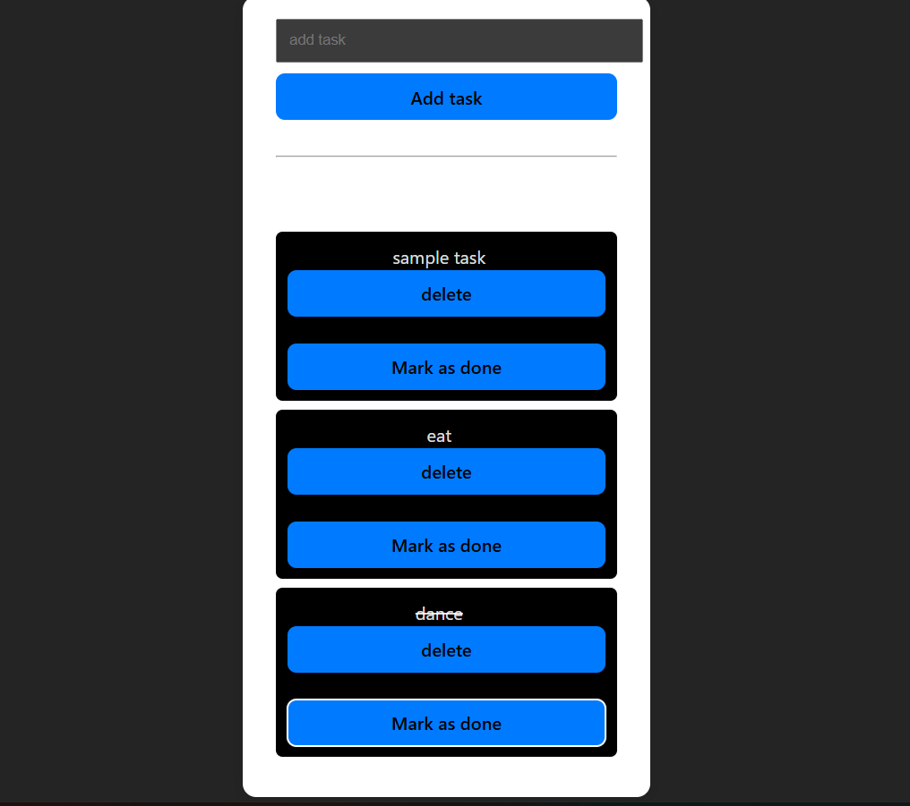

React Todo App

React Todo App

A simple and clean Todo application built with React + Vite + JS.
my first react mini-project.

✨ Features

✅ Add new tasks  
✅ Delete existing tasks  
✅ Mark tasks as completed (with line-through styling)  
✅ Clean and minimal UI. 
✅ Powered by Vite for lightning-fast builds.

📫 Contact Me

If you'd like to connect, reach out here:

🌐 GitHub: [@your-github-username](https://github.com/parthsakpal07)  
💼 LinkedIn: [your-linkedin-profile](https://www.linkedin.com/in/parth-sakpal-513905317?utm_source=share&utm_campaign=share_via&utm_content=profile&utm_medium=android_app)  

👨‍💻 Author

Parth Vinayak Sakpal
